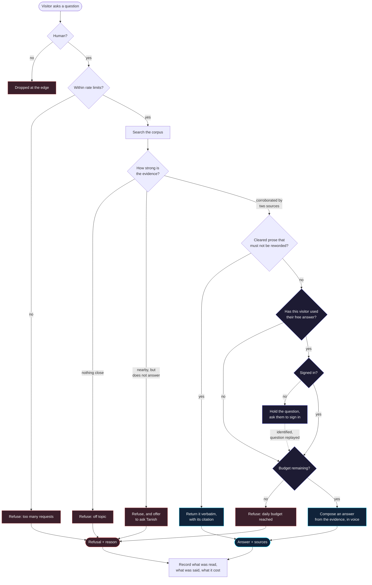
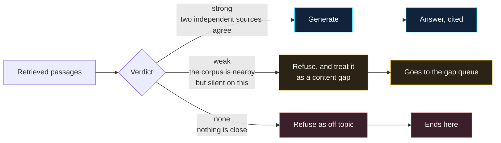
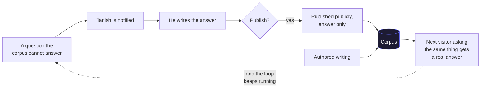
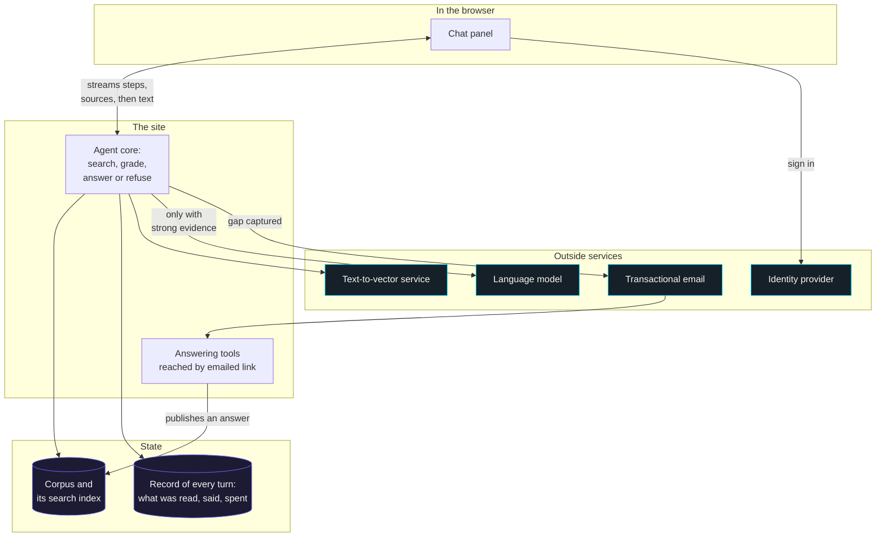

# 14 — Architecture

← [Index](README.md) · Prev: [13 Risks](13-risks.md)

Conceptual view. No schemas, endpoints, or libraries. Those live in
[03 Data model](03-data-model.md), [05 Runtime](05-runtime.md), and
[12 Delivery](12-delivery.md).

## Request lifecycle

The shape to notice: **the expensive path and the cheap path diverge before anything costly
happens.** Refusing is free and anonymous. Answering costs money, so it is the only thing gated.

Three properties the diagram encodes:

1. **Nothing reaches the model without corroborated evidence.** Every path into generation passes
   the grading diamond first.
2. **Refusal is never gated.** No sign-in, no budget check, no cost. A visitor can watch the agent
   decline all day, which is the behavior worth showing.
3. **The sign-in step preserves the question.** It is held and replayed, not discarded.

## What the grading decides

Retrieval always returns something, because every document in the corpus is about the same person.
So the interesting question is never "did we find anything" but "is what we found actually an
answer". Three outcomes, and only one of them is allowed to speak.

The middle band is the whole design. A question about Tanish that the corpus cannot answer still
looks topically related, so a system that answers whenever retrieval returns *something* produces
its most confident wrong claims exactly there. This one refuses instead, and files it.

## The content loop

The gap queue is why the agent gets better without anyone maintaining it. Blind spots become
questions; questions become published answers; published answers become part of what the agent
knows, with no deploy.

Two inlets to the corpus, both human-written: authored prose, and answers to real questions.
Nothing is extracted automatically, which is what keeps the agent from disclosing things the
public pages deliberately abstract away.

## Components

Roles, not vendors. The mapping to providers is in [12 Delivery](12-delivery.md).

Worth noting what is absent: the agent has no tools, no ability to read the repository, and no path
to the internet. Its entire capability is looking things up in the corpus. That is a deliberate
constraint, not a stage of development. See [00 Overview](00-overview.md).

The one asymmetry: **everything the agent reads is human-written, and everything it says is
recorded.** Both directions are auditable, which is the property that makes it safe to point at a
real person's name.
